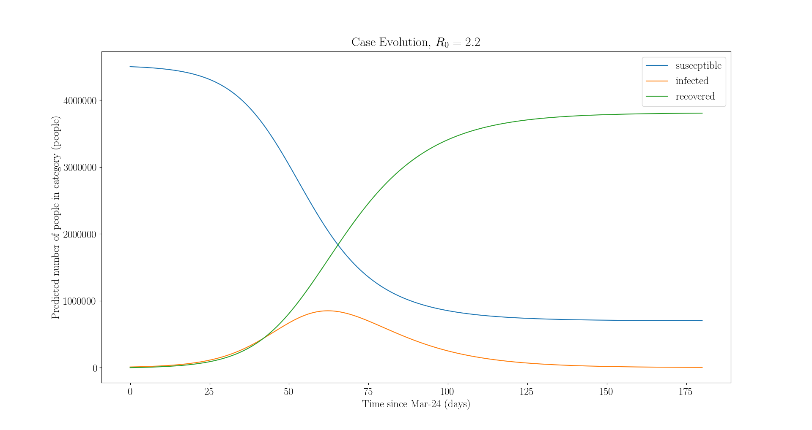
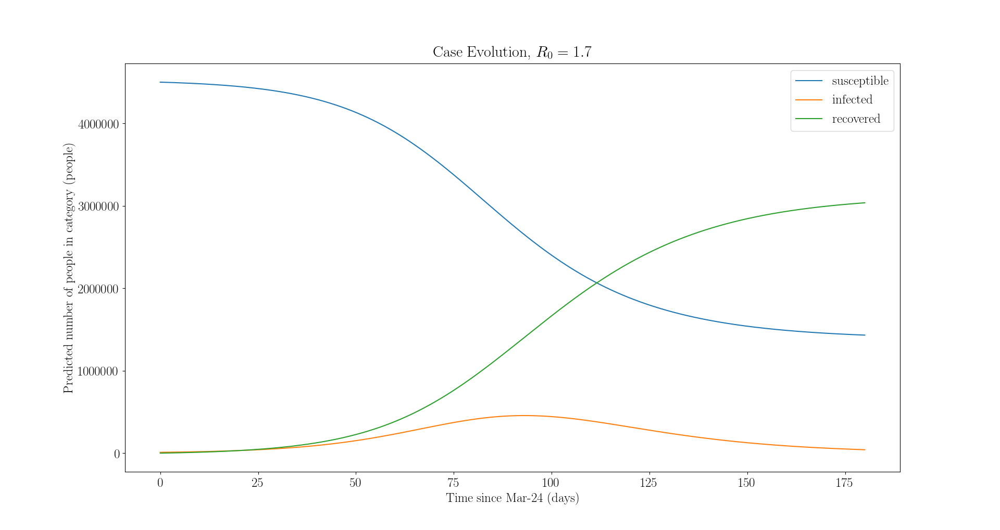

Simple SIR model disease dynamics. Working on adding a spatial component for multiple cities with different densities. This is only a first pass attempt at disease modeling---there are more sophisticated models available, but this may provide a rough idea of how COVID-19 could evolve.

Uses a Kermack-McKendrick model, more information [here](https://web.stanford.edu/~jhj1/teachingdocs/Jones-on-R0.pdf).

For example, assuming 10,000 current cases, R0 of 2.2, and an infectious duration of 12 days using the Boston metro area population, the model shows the following evolution from Mar-24 onward:

Now, lowering R0 to e.g., 1.7 via social distancing or other preventions, the evolution is:

